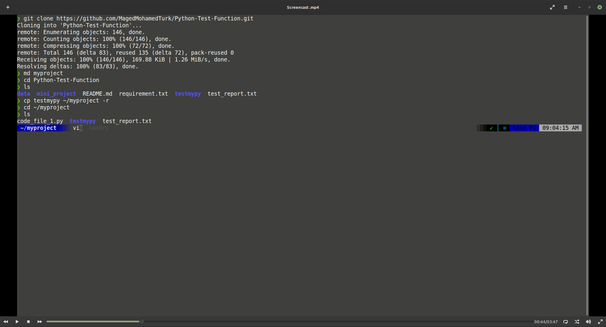
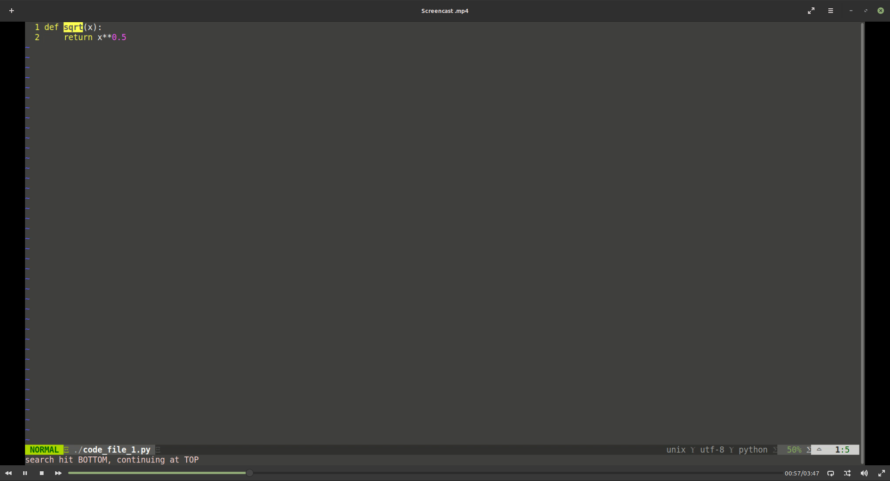
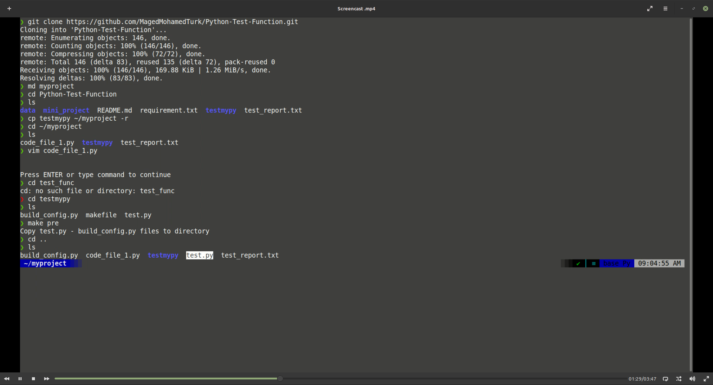
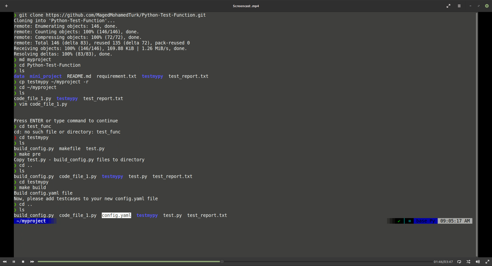
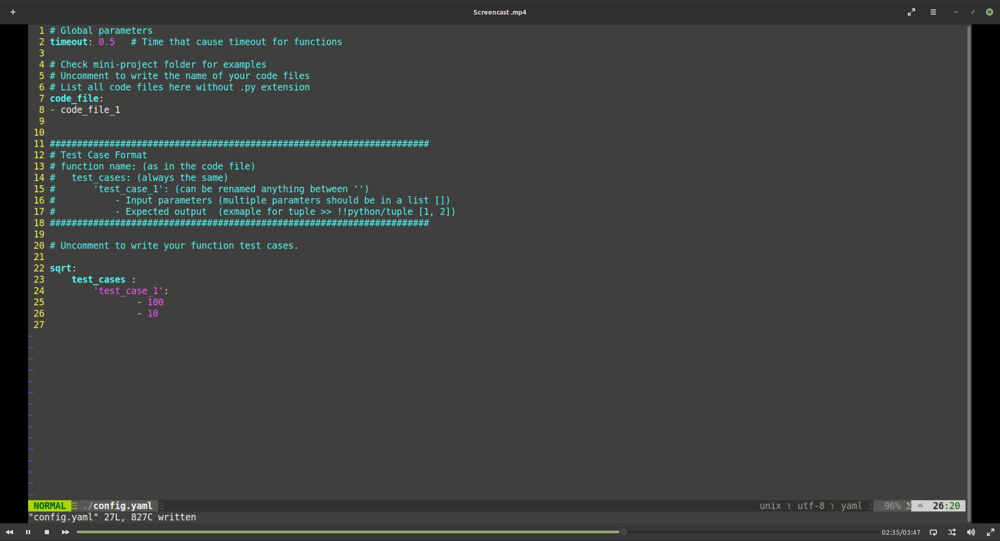
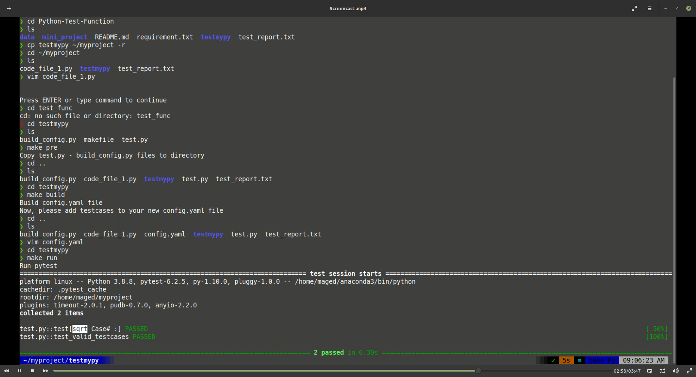

# Introduction 
This is a snippet to compactly test function in python.  
The snippet collects all your code files in the project directory and then collects all the functions one by one and test them against test cases you specify.  
Test cases are data-based tests that assert the known inputs of a function will return expected outputs.  
The snippet make use of `pytest ` package and test cases are expected to be in `config.yaml`

# Installation
> * Clone the repo...  
`$ git clone https://github.com/MagedMohamedTurk/Python-Test-Function.git`  
* Run the following to up to date with the required packages:  
`pip install -r requirement.txt`  

# In Action!

# USAGE  
Copy testmypy/ directory to your Python project:  
`$ cp -r testmypy/ yourWorkingProject/`  
`$ cd yourWorkingProject/testmypy/`  
Utilizing `makefile` to test your Python functions:  
>1- `$ make pre`  
Copying files to the working directory

>2- `$ make build`  
Building `config.yaml` file, collect all the python files. 
edit the config.yaml file to add testcases for the functions in the files.

>3- `$ make run`  
Run `pytest` to test the functions against the testcases you entered in the config.yaml.

>4- `$ make report`    
To make 'test_report.txt' file with the output.

>5- `$ make clean`  
To clean all the files added previously by the script.  

# Mini Project  
you can try the commands in the miniproject folder.  
you can skip #2 `make build` you can `cp trythisconfig.yaml config.yaml` and follow up wih steps from #3
 
Note that intensionally we made unoptimized function that cause the test to return timeout error.  
Timeout is set in `config.yaml` to 0.5 second.
